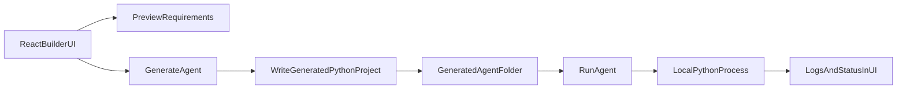

# Alpha Agent Builder

`Alpha Agent Builder` is a standalone app under `2_openai/alpha_agent_builder` that lets a user:

- sign up and log in
- describe what an agent should do
- choose an LLM provider and model
- manage API keys and GitHub access from Settings
- decide the generated frontend style
- enable richer built-in tools
- support uploaded context files
- generate Python agent projects in the backend (**LLM writes `logic.py`** from your instructions when an API key is set; validated and merged with templated UI/runner files)
- create the local agent folder first and show it in the UI
- check into Git only when the user explicitly chooses to do so
- run a generated agent from a `Run Agent` button

## Generation model
- On **Generate**, the builder calls the same provider/model you selected and asks it to emit **`logic.py`** as JSON (real Python: APIs, HTTP, date filters, etc., not only prompt text).
- Output is **syntax-checked** and must define `run_agent_chat` and `run_agent_task`. If anything fails (no API key, invalid JSON, validation error), the app **falls back** to the classic template `logic.py`.
- **`app.py` / `main.py` / `run_agent.py`** stay **templated** so Gradio, CLI, and FastAPI entrypoints stay consistent.

## Architecture
- `backend/`: FastAPI service for provider metadata, requirements preview, project generation, and local runs.
- `frontend/`: React + Tailwind web app for the builder UI.
- `generated_agents/`: output folder where generated agent projects are written.

## Flow


## Backend API
- `GET /health`
- `POST /api/auth/signup`
- `POST /api/auth/login`
- `GET /api/auth/me`
- `POST /api/auth/logout`
- `GET /api/settings`
- `PUT /api/settings`
- `PUT /api/settings/profile`
- `PUT /api/settings/password`
- `GET /api/providers`
- `POST /api/requirements/preview`
- `POST /api/agents/generate`
- `GET /api/agents`
- `GET /api/agents/{agent_id}`
- `POST /api/agents/{agent_id}/checkin`
- `GET /api/agents/{agent_id}/uploads`
- `POST /api/agents/{agent_id}/uploads`
- `POST /api/agents/run`
- `GET /api/agents/{agent_id}/logs`

## Frontend Features
- login and signup flow
- settings icon with self-service account management
- saved API keys and GitHub token in SQLite
- polished landing page and builder form
- provider and model selection
- richer generated tool selection
- file upload support for the builder runner
- local agent folder path and generated file list shown after creation
- manual `Check In to Git` button after the agent is created
- requirements and generated file preview
- generated agent list
- `Run Agent` action with latest logs panel

## Backend Setup
```bash
cd /Users/maneeshmukundan/projects/agents/2_openai/alpha_agent_builder
python3 -m venv backend/.venv
source backend/.venv/bin/activate
pip install -r backend/requirements.txt
uvicorn backend.main:app --reload
```

If you prefer to keep the virtual environment outside `backend/`, this also works:

```bash
cd /Users/maneeshmukundan/projects/agents/2_openai/alpha_agent_builder
python3 -m venv .venv
source .venv/bin/activate
pip install -r backend/requirements.txt
uvicorn backend.main:app --reload
```

Recommended backend URL: `http://127.0.0.1:8000`

## One-Command Startup
From the project folder, run:

```bash
bash start_alpha_agent_builder.sh
```

This script will:
- create `backend/.venv` if needed
- install backend requirements
- install frontend packages if `node_modules` is missing
- start the FastAPI backend
- start the React frontend

By default it serves:
- backend at `http://127.0.0.1:8000`
- frontend at `http://127.0.0.1:5173`

You can override ports and hosts if needed:

```bash
BACKEND_PORT=8010 FRONTEND_PORT=5174 bash start_alpha_agent_builder.sh
```

## Frontend Setup
```bash
cd /Users/maneeshmukundan/projects/agents/2_openai/alpha_agent_builder/frontend
npm install
npm run dev
```

Recommended frontend URL: `http://127.0.0.1:5173`

## Generated Agent Output
Each generated agent includes:

- `logic.py`
- `run_agent.py`
- `requirements.txt`
- `.env.example`
- `README.md`
- `agent_config.json`
- `main.py` or `app.py` depending on the selected generated frontend
- optional `uploads/` folder when file uploads are enabled

When you run generated agents from Alpha Agent Builder, provider API keys come from the logged-in user's saved Settings rather than a local `.env` file.
Generated agents are always created on the local machine first. Git check-in only happens if the user presses the explicit check-in button afterward.

## First-Version Constraints
- Uses one **default agent template** (`default_agent`): shared shell (UI/runner), combined style hint, and `requests` in base requirements; no template picker in the UI.
- Supports deterministic, template-driven Python project generation for that shell (plus optional LLM-written `logic.py`).
- Supports curated providers: `OpenAI` and `Gemini`.
- Supports generated frontends: `CLI`, `Gradio`, and `FastAPI API`.
- Supports richer built-in tools such as document context, structured output, citation notes, and checklist planning.
- Supports per-agent uploaded text-style context files when uploads are enabled.
- Supports optional repo check-in when the user saves a GitHub token and repo URL in Settings and explicitly presses the check-in action.
- Runs one agent at a time and captures the latest logs.
- Stores users, settings, sessions, and saved integration secrets in a local SQLite database.
